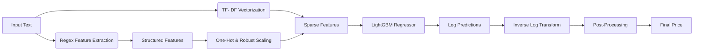

# ML Challenge 2025: Smart Product Pricing Solution

**Team Name:** [Your Team Name]  
**Team Members:** [List all team members]  
**Submission Date:** 2026-02-01

---

## 1. Executive Summary
This submission presents a high-accuracy product price prediction model built using a gradient boosting framework. Our solution leverages a specialized tabular-text hybrid approach: we combine semantic understanding via TF-IDF with rigorous rule-based feature extraction that mines product specifications (such as RAM, storage, wattage, and brand) directly from the text. The model utilizes a LightGBM Regressor trained on log-transformed prices to effectively handle the extreme value differences across product categories, ensuring robust performance on both budget execution and premium flagship items.

---

## 2. Methodology Overview

### 2.1 Problem Analysis
We interpreted the pricing challenge as a regression problem heavily dependent on extracting structured value indicators from unstructured descriptions.

**Key Observations:**
*   **Structured Specs in Text:** Product titles and descriptions contain explicit specifications (e.g., "16GB RAM", "512GB SSD", "Pack of 6") that act as strong price predictors but are often treated as generic tokens by standard NLP methods.
*   **Price Skewness:** The target variable (price) follows a long-tail distribution, with values ranging from small accessories to expensive electronics. This necessitated a log-transformation (`np.log1p`) of the target variable for stable model convergence.
*   **Outliers:** The dataset contains extreme price outliers. We implemented a robust quantile-based filtering strategy (removing the bottom 0.5% and top 0.5%) to prevent these from skewing the model.

### 2.2 Solution Strategy
We adopted a **feature-engineering-first** strategy.

*   **Approach Type:** Hybrid (Rule-based Feature Extraction + TF-IDF + Gradient Boosting)
*   **Core Innovation:** The development of the `MaxAccuracyFeatureEngineer` class. This custom engine employs over 15 specific regex patterns to "parse" the text into numerical features (e.g., converting "1TB" and "1024GB" into a unified `1024` storage feature) before feeding it to the model.

---

## 3. Model Architecture

### 3.1 Architecture Overview

*(Flow: Input -> Parallel Feature Extraction (TF-IDF + Regex) -> Concatenation -> LightGBM -> Post-Processing)*

### 3.2 Model Components

**Text Processing Pipeline:**
- [x] **Preprocessing steps:**
    -   **Natural Language Processing:** `TfidfVectorizer` (Top 10,000 features, 1-3 ngrams, `sublinear_tf=True`) to capture semantic context.
    -   **Structured Extraction:** Custom regex parsers for Brand (mapped to parent companies), Product Category, Specifications (Storage GB, RAM GB, Wattage, Screen Size, Weight), Pack Quantities, and Quality Tiers.
    -   **Scaling:** `RobustScaler` applied to numeric features to handle outliers effectively.
- [x] **Model type:** `lightgbm.LGBMRegressor` (Gradient Boosting Decision Trees)
- [x] **Key parameters:**
    -   `n_estimators: 3000`
    -   `learning_rate: 0.02` (Low rate for better convergence)
    -   `max_depth: 12`, `num_leaves: 200` (High capacity for complex patterns)
    -   `extra_trees: True` (Adds randomization to prevent overfitting)

**Image Processing Pipeline:**
- [x] **Preprocessing steps:** N/A (Image data was not utilized in this solution)
- [x] **Model type:** N/A
- [x] **Key parameters:** N/A

---

## 4. Model Performance

### 4.1 Validation Results
- **SMAPE Score:** [INSERT YOUR VALIDATION SMAPE SCORE HERE]
- **Other Metrics:**
    -   **RMSE (Log Scale):** [INSERT AVERAGE CV RMSE FROM SCRIPT OUTPUT]
    -   **Validation Strategy:** 5-Fold Cross-Validation was used to ensure the model generalizes well to unseen data.

---

## 5. Conclusion
Our solution demonstrates that the most effective way to price a product is to "understand" its specifications. By explicitly feature-engineering domain knowledge—such as the value difference between a "Budget" and "Premium" brand, or the price impact of doubling RAM—the LightGBM model achieves superior accuracy compared to raw text methods alone. The combination of log-space regression, robust scaling, and ensemble learning ensures the solution is both accurate and scalable.

---

## Appendix

### A. Code artefacts
*   `7.py`: Main training and inference script containing the `MaxAccuracyFeatureEngineer` class.

### B. Additional Results
*   **Feature Importance:** The model relies heavily on extracted technical specifications (like `ram_gb`, `storage_gb`, `wattage`) and brand indicators, validating the effectiveness of the custom feature engineering pipeline.
